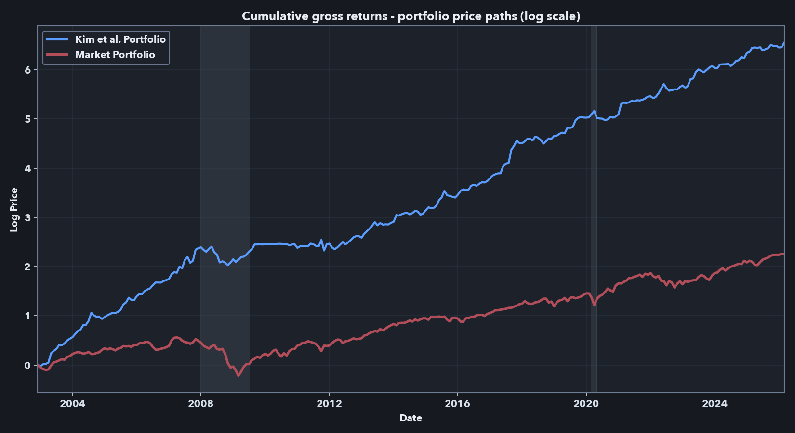
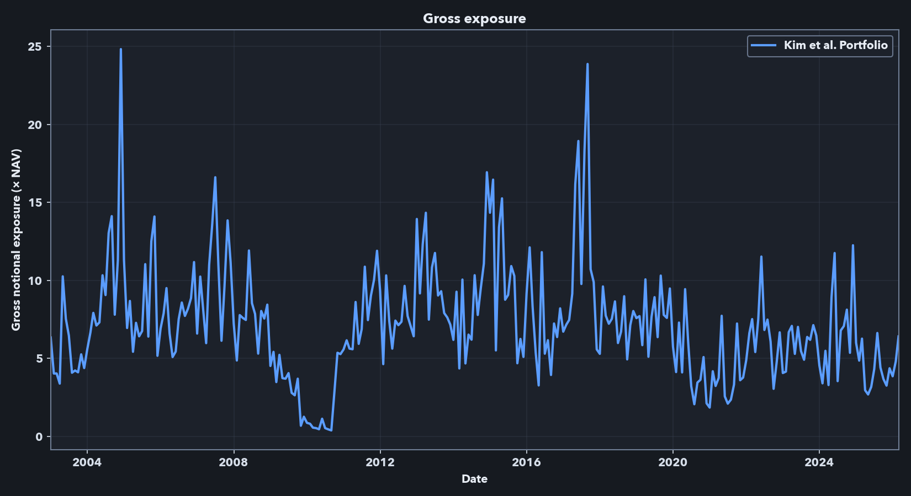
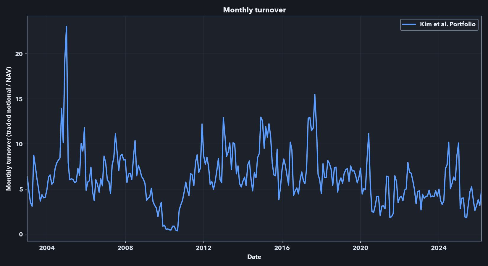
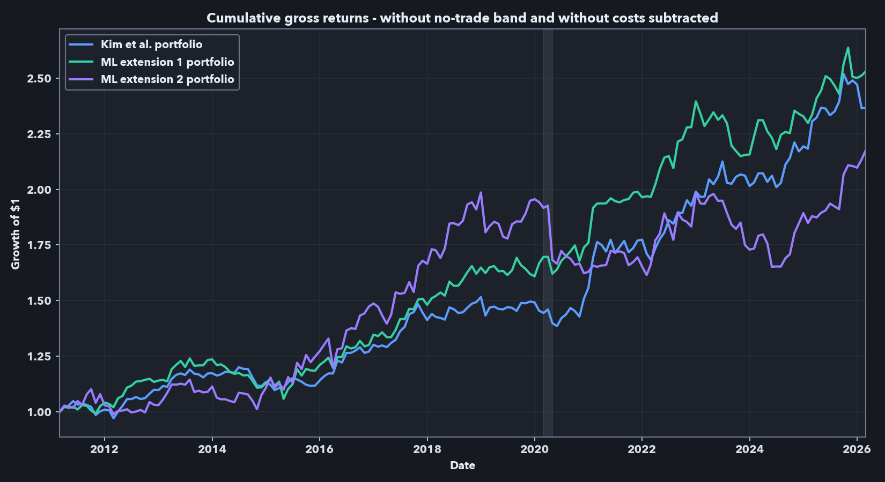
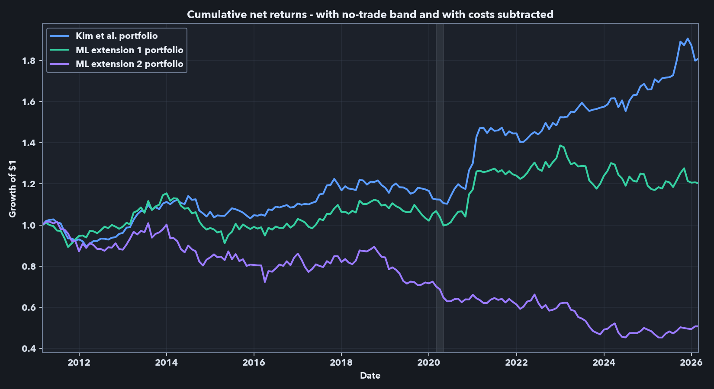
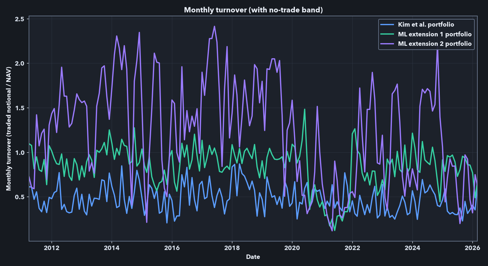

***Point-in-Time Equity Research Pipeline in Python***

*Independent implementation and extension of Kim, Korajczyk, and Neuhierl (2021), using Sharadar point-in-time data, rolling portfolio formation, and out-of-sample evaluation.*

**Code:** [Public GitHub repository](https://github.com/danielpellatt/Arbitrage-Portfolios-Project)  
**Data note:** Full replication requires licensed [Sharadar](https://data.nasdaq.com/publishers/SHARADAR) / Nasdaq Data Link data, which are not redistributed. The public repository includes a synthetic demo path to illustrate pipeline functionality and repository structure, rather than to reproduce the project’s empirical results.  
**Supplementary materials:** [Detailed results workbook](assets/regression%20results/equity_pipeline_results_supplement.xlsx) · [Model note (PDF)](assets/pdfs/Supplementary_model_note.pdf)  
**Related papers:** [Kim, Korajczyk, and Neuhierl (2021)](https://academic.oup.com/rfs/article-abstract/34/6/2813/5902462) · [Non-gated version](https://papers.ssrn.com/sol3/papers.cfm?abstract_id=3263001) · [Freyberger, Neuhierl, and Weber (2020)](https://academic.oup.com/rfs/article-abstract/33/5/2326/5821383)

## Overview

This project takes the arbitrage-portfolio methodology of Kim, Korajczyk, and Neuhierl (2021) from paper to a working Python research pipeline. The method uses firm characteristics to separate characteristic-driven factor exposures from a residual mispricing component, then forms a long-short portfolio from the estimated mispricing function. I present the project as a research and engineering exercise rather than as a trading recommendation.

The broader contribution is the pipeline: it ingests raw vendor data, enforces point-in-time timing, constructs daily and monthly equity panels, builds stock-level characteristics, estimates rolling portfolio-formation models, and evaluates portfolios with return, factor-regression, exposure, turnover, and cost diagnostics. The same framework can be reused to evaluate other cross-sectional return-prediction methods.

The main empirical findings are:

1. A Sharadar-based, point-in-time implementation recovers the central Kim et al. frictionless result: a low-market-beta long-short portfolio with high frictionless Sharpe ratios and positive factor-adjusted returns.
2. The signal remains visible after 2018, beyond the original paper sample.
3. The paper-comparable result has high gross exposure and turnover, so it should not be treated as directly implementable without additional constraints and cost assumptions.
4. The final cost-aware holdout is economically informative but more qualified than the frictionless results: after no-trade-band execution and spread-cost deduction, displayed factor-adjusted alpha evidence weakens and realized market exposure becomes statistically significant, even though the Kim-style baseline remains the strongest model family considered.
5. Two XGBoost extensions showed gross-return promise, but did not produce robust net-of-cost improvement on the final holdout; turnover and spread-cost drag were especially important for the ML variants.

## What the pipeline does

The code is organized into five layers so that raw-data handling, point-in-time panel construction, feature engineering, rolling portfolio formation, and evaluation remain separable.

1. **Layer A — raw data cache:** ingests vendor bulk tables and writes a local raw-data cache.
2. **Layer B — point-in-time panels:** builds daily and monthly panels, computes current and forward returns, merges fundamentals, applies delisting-return assumptions at true exits, and attaches risk-free and market data.
3. **Layer C — feature engineering:** constructs the stock-level characteristic set used by the portfolio-formation models.
4. **Layer D — portfolio formation:** estimates portfolio weights on rolling windows after applying history, feature-completeness, forward-return, volume, and market-cap screens.
5. **Layer E — evaluation:** evaluates realized returns, factor-adjusted performance, turnover, trading costs, gross exposure, and active holdings.

At each month-end, Layer D forms portfolios only with information that would have been available at that date. Layer E then rolls the realized path forward and reports both paper-comparable frictionless results and implementation-aware diagnostics.

## Data and point-in-time design

This is a [Sharadar](https://data.nasdaq.com/publishers/SHARADAR)-based independent implementation, not a literal CRSP/Compustat reproduction of Kim et al. The goal is to preserve trading-date timing while using a different point-in-time data source.

The panel is large enough for rolling cross-sectional portfolio formation: 15,381 securities, 36.89 million daily security observations, and 1.77 million price-present firm-months from 1998-01 to 2026-02. After the history, feature-completeness, volume, and baseline market-cap screens, the headline Kim-style reproduction universe contains 934,751 stock-months, averaging 3,350 stocks per month across 279 monthly portfolio formations. The stricter NYSE-referenced 10th-percentile screen used later for implementation-aware comparisons contains 667,688 stock-months and averages 2,393 stocks per month, a 28.6% reduction relative to the baseline universe.

Key design choices:

- **Point-in-time timing.** Firm fundamentals are aligned using Sharadar’s point-in-time as-reported series, with an added one-trading-day safety shift to avoid filing-revision leakage and same-day lookahead bias.
- **Daily-to-monthly construction.** The models are estimated monthly, but daily data are used to construct return, volatility, beta, turnover, spread, maximum-return, and 52-week-high features.
- **Delisting and return conventions.** Sharadar does not provide CRSP-style delisting returns, so I apply explicit assumed exit payoffs only at true ends of permaticker price histories. Sharadar corporate actions are used to separate distressed, non-distressed, and ambiguous exits. To keep final evaluations conservative, downward delisting adjustments are applied to long position returns but not to short position returns in Layer E.
- **Feature construction and coverage.** I engineered 60 final stock-level characteristics closely aligned with the Freyberger/Kim feature set, using documented Sharadar proxies where the schemas differ. I exclude operating accruals (OA) and absolute operating accruals (AOA) because their Sharadar proxy coverage is weaker: from the first headline portfolio date onward, those variables are available for roughly 78% of otherwise eligible rows, while the final 60-feature set is complete for 97.9% of comparable rows.
- **Universe definitions.** 
  - **Baseline reproduction universe.** Kim et al. use NYSE, Amex, and Nasdaq U.S. common stocks with CRSP/Compustat data. My implementation uses Sharadar rather than CRSP/Compustat, and Sharadar exchange metadata is not a fully point-in-time reconstruction of historical listing venue. I therefore approximate the paper’s exchange universe using NYSE, Nasdaq, AMEX, and NYSE MKT / NYSE American domestic common stocks. Because this modern vendor classification can introduce additional very small names, I apply a point-in-time whole-universe 10th-percentile market-cap screen at the portfolio estimation stage. This keeps the headline reproduction broad while limiting the influence of extremely small firms with likely high trading frictions.
  - **Implementation-aware comparison universe.** For the later implementation-aware comparisons, I use a stricter 10th-percentile screen based on NYSE market-cap breakpoints. This is closer to Kim et al.’s no-microcap robustness check and more appropriate for turnover and cost analysis. Because NYSE breakpoints are based on larger firms, the screen removes substantially more than 10% of the broader Sharadar universe; in my implementation, it reduces the monthly formation universe by an additional 28.6% on average relative to the baseline reproduction universe.

## Independent reproduction of Kim et al. (2021)

The first empirical question is whether the central Kim et al. result appears in an independent implementation. It does; the result remains observable after the time period observed in the paper as well.

For the headline comparison, I use the baseline reproduction universe and the Kim et al. portfolio-weight estimator in a paper-comparable frictionless specification. I focus on the six-eigenvector version: Kim et al.’s Table 3 shows performance improving up to roughly six or seven eigenvectors, and their Table 5 reports the main risk-adjusted return regressions for the six-eigenvector portfolio. Using six eigenvectors gives a clean reference point without turning the number of latent factors into an additional tuning choice. 

As in the main empirical application in Kim et al., rolling estimation windows are used, with 12 months of history in each used for model/weight estimation at each portfolio rebalance date. This setup is used throughout my analysis.

The comparison below should be read as an independent implementation rather than an exact database match. My implementation uses Sharadar point-in-time inputs, documented feature proxies where the data schemas differ, and a somewhat different sample period. The relevant question is whether the methodology survives those changes.

<strong>Table 1. Paper-comparable six-eigenvector portfolio model reproduction</strong>

<table class="academic-table">
  <thead>
    <tr>
      <th>Source / window</th>
      <th>Dates</th>
      <th>Mean (%/yr)</th>
      <th>Std. dev. (%/yr)</th>
      <th>Sharpe</th>
      <th>Max. drawdown (%)</th>
      <th>CAPM alpha (%/mo)</th>
      <th>CAPM beta</th>
      <th>FF5+UMD alpha (%/mo)</th>
      <th>FF5+UMD mkt. beta</th>
    </tr>
  </thead>
  <tbody>
    <tr>
      <td>Kim et al. published result, six-eigenvector model</td>
      <td>1968-2018</td>
      <td class="num">29.48</td>
      <td class="num">18.42</td>
      <td class="num">1.60</td>
      <td class="num">20.84</td>
      <td class="num">2.49*** (t=8.89)</td>
      <td class="num">-0.06 (t=-0.86)</td>
      <td class="num">2.17*** (t=8.35)</td>
      <td class="num">-0.03 (t=-0.50)</td>
    </tr>
    <tr>
      <td>My implementation, paper-overlap window</td>
      <td>2002-12 to 2018-12</td>
      <td class="num">31.45</td>
      <td class="num">21.24</td>
      <td class="num">1.48</td>
      <td class="num">31.31</td>
      <td class="num">2.64*** (t=5.42)</td>
      <td class="num">-0.03 (t=-0.18)</td>
      <td class="num">2.80*** (t=5.74)</td>
      <td class="num">0.03 (t=0.15)</td>
    </tr>
    <tr>
      <td>My implementation, full available sample</td>
      <td>2002-12 to 2026-02</td>
      <td class="num">30.50</td>
      <td class="num">20.46</td>
      <td class="num">1.49</td>
      <td class="num">31.31</td>
      <td class="num">2.68*** (t=6.83)</td>
      <td class="num">-0.16 (t=-1.29)</td>
      <td class="num">2.70*** (t=6.66)</td>
      <td class="num">-0.07 (t=-0.52)</td>
    </tr>
    <tr>
      <td>My implementation, post-2018 period</td>
      <td>2019-01 to 2026-02</td>
      <td class="num">28.34</td>
      <td class="num">18.69</td>
      <td class="num">1.52</td>
      <td class="num">17.20</td>
      <td class="num">2.78*** (t=5.06)</td>
      <td class="num">-0.35*** (t=-2.88)</td>
      <td class="num">2.62*** (t=3.84)</td>
      <td class="num">-0.22 (t=-1.48)</td>
    </tr>
  </tbody>
</table>

Values are annualized except for alpha, which is monthly. Risk-adjusted return regressions are monthly time-series regressions of the portfolio’s excess returns on standard factor returns. Coefficient cells report the estimate with the Newey-West t-statistic in parentheses. CAPM alpha and beta are the intercept and market excess-return coefficients, respectively, in the CAPM regression; FF5+UMD alpha and mkt. beta are the intercept and market-factor coefficients, respectively, in the Fama-French five-factor plus momentum regression. The intercept, or alpha, is the average monthly return not explained by the risk factors in these regressions. Significance stars use two-sided tests: *** p&lt;.01; ** p&lt;.05; * p&lt;.1. The supplemental workbook reports the full coefficient tables for all risk-adjusted return regressions.

**The reproduction is successful in the key dimensions that matter here:** the independent Sharadar-based implementation produces a low-market-beta long-short portfolio with high frictionless Sharpe ratios and positive factor-adjusted returns (alphas). The post-2018 window is also important because it tests whether the signal persists beyond the original paper’s sample period.

<figure>
  
  <figcaption><strong>Paper-comparable result reproduction.</strong> Gross cumulative log returns at the 20% volatility target, before transaction costs.  The blue line represents the logarithmic price path (i.e., the cumulative returns) of the arbitrage portfolio. The red line represents the market portfolio. Shaded areas represent NBER recessions.</figcaption>
</figure>

The stricter NYSE-referenced 10th-percentile size screen produces lower performance in my data, but the result remains in the same range as the no-microcap robustness check in the Kim et al. appendix. For example, they report a Sharpe ratio of 1.14 and CAPM and FF5+UMD alphas of 1.86 and 1.45, respectively, over 1968-2018 while my implementation with the NYSE 10th percentile filter indicates a slightly lower Sharpe of 0.88 and respective alphas of 1.84 and 2.16 over the period of overlap (2002-12 to 2018-12). Further results using this universe are reported below. I use the stricter screen for the later cost-aware comparison because very small stocks are more likely to create implementation problems, especially on the short side. The detailed reproduction implementation and alpha tables for both screens are in the supplemental workbook linked above.

**Scaling note:** Following Kim et al., in the results above I scale each monthly target book to a 20% annualized in-sample volatility target. This makes the paper-comparable results comparable across specifications and closer in scale to common equity factors. However, it also introduces volatility targeting: when the estimated target portfolio is more volatile in the rolling window, the scaling step applies a smaller scale factor, reducing scaled gross exposure. The flatter period around 2009–2010 appears consistent with this mechanism. Because the frictionless exposures reported below are high, the implementation-aware analysis below treats the volatility target as a portfolio-construction parameter and considers lower targets alongside exposure constraints.

## Implementation caveat: exposure and turnover

The performance metrics and cumulative return plot above are frictionless. An implementable strategy using this signal would face leverage, shorting capacity, borrow, liquidity, financing, and transaction-cost constraints. Below, I report gross exposure as the sum of absolute long and short weights, expressed as a multiple of net asset value (NAV). A gross exposure of 3.0 means $3 of long-plus-short notional per $1 of strategy capital. I report monthly turnover as traded notional divided by NAV; a value of 2.0 means the rebalance traded notional equals 200% of the capital base.

The headline frictionless Kim-style run presented above has high exposure and high turnover. Across the full sample, average gross exposure is 7.18x, median gross exposure is 6.83x, and the maximum is 24.83x. Average monthly turnover is 6.25x NAV, with a median of 5.97x and a maximum turnover of 23.05x. These numbers explain why the frictionless result cannot be treated as directly implementable: a 7x average gross book and monthly turnover above 6x NAV would require leverage, shorting, liquidity, financing, borrow, and trading-cost assumptions that are absent from the paper-comparable benchmark. They motivate the first-pass implementation-aware analysis below, which focuses on constraints I can model directly in this data: excluding the smallest stocks, lowering volatility targets, capping gross exposure, adding no-trade bands, and deducting spread-based transaction costs. Because financing, borrow availability, borrow fees, market impact, and institutional execution are not fully modeled, the net results in the sections below should be read as implementation-aware diagnostics rather than as a deployable trading strategy.

<figure>
  
  <figcaption><strong>Frictionless target exposure.</strong> The paper-style target book often requires substantial gross exposure.</figcaption>
</figure>

<figure>
  
  <figcaption><strong>Monthly turnover.</strong> The unconstrained paper-style portfolio can trade several times NAV per month.</figcaption>
</figure>

## Implementation-aware evaluation and nonlinear extensions

**Implementation-aware levers.** The exposure and turnover diagnostics above motivate a first-pass implementation-aware evaluation. Relative to the paper-comparable frictionless run, this stage makes three pre-cost changes: it uses the stricter NYSE-referenced 10th-percentile universe, lowers the annual volatility target and imposes gross-exposure caps, and allows no-trade bands in execution. Lower volatility targets reduce scaled gross exposure, gross caps bound the target book directly, and no-trade bands skip small rebalances likely to be cost-dominated. I then report a separate net path that deducts stock-level spread costs.

**Spread-based cost rule.** For the cost rule, I use 0.5 * cs_spread * traded_notional, where cs_spread is a stock-level monthly average [Corwin-Schultz](https://onlinelibrary.wiley.com/doi/10.1111/j.1540-6261.2012.01729.x) high-low spread proxy estimated from daily price data. At each rebalance, the backtest applies this half-spread cost to each stock’s traded notional, so more illiquid names and higher-turnover portfolios face larger deductions. I use this proxy because the Sharadar data did not include a full historical quote file. This is intentionally a first-pass cost model: it does not include market impact, financing, borrow fees, locate risk, forced buy-ins, or securities-lending constraints, but it does make the backtest face stock-level stock-level liquidity differences and turnover.

**Nonlinear extensions.** I also test two nonlinear XGBoost extensions. These are not generic ML overlays: Kim et al.'s alpha step can be written as a linear regression of factor-residualized average returns on characteristics, so the **mean-target** extension keeps that same residualized target and replaces only the linear map with XGBoost. The **panel-target** extension uses the month-level analogue of the same residualized target inside the rolling window. The mean-target version is therefore closer to Kim et al.'s original estimator, while the panel-target version is more experimental. In both cases, the predicted signal is projected back against the selected estimated Kim-style beta-loading space before volatility scaling and final portfolio formation. A short derivation is in the [supplementary model note (PDF)](assets/pdfs/Supplementary_model_note.pdf). These are empirical nonlinear extensions rather than new asymptotic results.

**Model selection and final holdout.** Model selection is separated from final evaluation. I first ran frictionless screening on **2002-12 to 2008-02** and validation on **2008-03 to 2011-02** to choose one representative Kim baseline, one mean-target ML model, and one panel-target ML model, including the XGBoost hyperparameter profiles for the ML branches, favoring Sharpe while checking alpha and stability. Holding those family representatives fixed, I then used the combined **2002-12 to 2011-02** pre-final period to choose the implementation levers—annual volatility target, gross-exposure cap, and no-trade band—based primarily on net Sharpe, with alpha and turnover used as secondary checks. The final holdout, **2011-03 to 2026-02**, was not used in either step. The panel-target (ML extension 2) branch was already the weakest of the three by the end of the pre-final cost-aware stage, but I still carried it into the 15-year holdout so the final comparison would show the full research record rather than silently remove the weakest branch.

For the final holdout, the selected implementation settings are:

- **Kim et al. baseline:** 12.5% annual volatility target, 2.5x gross cap, 0.25% no-trade band.
- **ML extension 1 — mean target:** 10.0% annual volatility target, 2.5x gross cap, 0.25% no-trade band.
- **ML extension 2 — panel target:** 12.5% annual volatility target, 4.5x gross cap, 0.50% no-trade band.

Table 2 separates two related objects. **Panel A** is the gross target path under the stricter universe and portfolio-construction constraints, before no-trade-band execution and before spread-cost subtraction. **Panel B** is the net executed path after drift, no-trade-band logic, and spread-cost deduction.

<strong>Table 2. Final-holdout comparison with validation-selected implementation settings</strong>

Panel A. Gross target path: before no-trade-band execution and transaction-cost subtraction.

<table class="academic-table">
  <thead>
    <tr>
      <th>Model</th>
      <th>Mean (%/yr)</th>
      <th>Std. dev. (%/yr)</th>
      <th>Sharpe</th>
      <th>CAPM alpha (%/mo)</th>
      <th>CAPM beta</th>
      <th>FF5+UMD alpha (%/mo)</th>
      <th>FF5+UMD mkt. beta</th>
    </tr>
  </thead>
  <tbody>
    <tr>
      <td>Kim et al. baseline</td>
      <td class="num">6.01</td>
      <td class="num">7.21</td>
      <td class="num">0.83</td>
      <td class="num">0.54*** (t=3.50)</td>
      <td class="num">-0.04 (t=-0.83)</td>
      <td class="num">0.51*** (t=2.87)</td>
      <td class="num">-0.01 (t=-0.28)</td>
    </tr>
    <tr>
      <td>ML extension 1: mean target</td>
      <td class="num">6.50</td>
      <td class="num">7.69</td>
      <td class="num">0.85</td>
      <td class="num">0.59*** (t=4.01)</td>
      <td class="num">-0.05 (t=-1.25)</td>
      <td class="num">0.49*** (t=3.25)</td>
      <td class="num">0.04 (t=0.95)</td>
    </tr>
    <tr>
      <td>ML extension 2: panel target</td>
      <td class="num">5.79</td>
      <td class="num">10.87</td>
      <td class="num">0.53</td>
      <td class="num">0.66*** (t=3.50)</td>
      <td class="num">-0.17*** (t=-2.92)</td>
      <td class="num">0.53** (t=2.57)</td>
      <td class="num">-0.06 (t=-0.87)</td>
    </tr>
  </tbody>
</table>

Panel B. Net executed path: after no-trade-band execution and spread-cost deduction.

<table class="academic-table">
  <thead>
    <tr>
      <th>Model</th>
      <th>Mean (%/yr)</th>
      <th>Std. dev. (%/yr)</th>
      <th>Sharpe</th>
      <th>CAPM alpha (%/mo)</th>
      <th>CAPM beta</th>
      <th>FF5+UMD alpha (%/mo)</th>
      <th>FF5+UMD mkt. beta</th>
      <th>Avg. turnover</th>
      <th>Avg. cost drag (%/mo)</th>
    </tr>
  </thead>
  <tbody>
    <tr>
      <td>Kim et al. baseline</td>
      <td class="num">4.02</td>
      <td class="num">6.72</td>
      <td class="num">0.60</td>
      <td class="num">0.22 (t=1.49)</td>
      <td class="num">0.11*** (t=2.70)</td>
      <td class="num">0.27* (t=1.80)</td>
      <td class="num">0.11*** (t=3.10)</td>
      <td class="num">0.48x</td>
      <td class="num">0.22</td>
    </tr>
    <tr>
      <td>ML extension 1: mean target</td>
      <td class="num">1.31</td>
      <td class="num">8.30</td>
      <td class="num">0.16</td>
      <td class="num">-0.04 (t=-0.26)</td>
      <td class="num">0.15** (t=2.40)</td>
      <td class="num">-0.04 (t=-0.33)</td>
      <td class="num">0.19*** (t=3.79)</td>
      <td class="num">0.85x</td>
      <td class="num">0.49</td>
    </tr>
    <tr>
      <td>ML extension 2: panel target</td>
      <td class="num">-4.50</td>
      <td class="num">10.22</td>
      <td class="num">-0.44</td>
      <td class="num">-0.51*** (t=-2.80)</td>
      <td class="num">0.13** (t=2.23)</td>
      <td class="num">-0.53*** (t=-3.21)</td>
      <td class="num">0.19*** (t=2.89)</td>
      <td class="num">1.25x</td>
      <td class="num">0.74</td>
    </tr>
  </tbody>
</table>

Final holdout: 2011-03-31 to 2026-02-28. Panel A evaluates the capped target book before trading-cost subtraction. Panel B uses the executed book after drift, no-trade-band logic, and spread-cost deduction. Coefficient cells report the estimate with the Newey-West t-statistic in parentheses. CAPM beta is the market excess-return coefficient in the CAPM regression; FF5+UMD mkt. beta is the market-factor coefficient in the Fama-French five-factor plus momentum regression. Significance stars use two-sided tests: *** p&lt;.01; ** p&lt;.05; * p&lt;.1. Detailed factor-regression output is in the supplemental workbook.

The gross results show why the ML variants were worth testing. Under the stricter universe and lower-risk settings, the mean-target model is close to the Kim baseline before explicit costs: annualized Sharpe is 0.85 versus 0.83, and both portfolios retain positive CAPM and FF5+UMD alphas. The panel-target model still shows positive gross alpha, but with materially weaker risk-adjusted performance.

The Panel A / Panel B contrast also changes the factor-regression interpretation. In Panel A, the displayed alphas are positive and statistically significant before no-trade-band execution and spread-cost subtraction. In Panel B, none of the displayed CAPM alphas is both positive and statistically significant; the Kim et al. baseline retains only a marginal displayed FF5+UMD alpha, the mean-target extension has near-zero displayed alphas, and the panel-target extension has significantly negative displayed alphas. At the same time, the displayed market betas become positive and statistically significant in the net executed regressions. I therefore read the net path as an implementation-aware diagnostic rather than as the same frictionless alpha object shown in the paper-comparable reproduction.

The net results are still the main economic comparison. Once the no-trade band and spread-cost rule are applied, the Kim et al. baseline is the clear winner: net Sharpe is 0.60 versus 0.16 for the mean-target model and -0.44 for the panel-target model. The mechanism is mostly the turnover/cost channel, not a hidden modeling wrinkle. Average monthly turnover rises from 0.48x NAV for the baseline to 0.85x for the mean-target model and 1.25x for the panel-target model, with corresponding average spread-cost drag of 0.22, 0.49, and 0.74% per month. In other words, the mean-target extension retains some gross signal, but its edge does not survive even this simple spread-cost deduction; the panel-target extension underperforms in each setting.

<figure>
  
  <figcaption><strong>Final holdout, before cost subtraction.</strong> The mean-target ML extension remains competitive with the baseline before costs.</figcaption>
</figure>

<figure>
  
  <figcaption><strong>Final holdout, net of costs.</strong> The baseline is strongest after spread-cost deduction and no-trade-band execution.</figcaption>
</figure>

<figure>
  
  <figcaption><strong>Turnover in the cost-aware holdout.</strong> The ML extensions trade more than the baseline, which helps explain the gap between gross and net results.</figcaption>
</figure>

## Technical notes

- Before volatility scaling and final portfolio formation, I project the ML signal against the selected estimated Kim-style beta-loading space. This mirrors the paper’s residualized-alpha logic by removing the estimated characteristic-driven common-factor component of the signal, but it is an estimated model-control step rather than a guarantee that realized CAPM or FF market betas will be zero.
- Forward returns are built separately from contemporaneous inputs, and the monthly formation sample must pass history, feature-completeness, forward-return, volume, and market-cap screens at each rebalance.
- Factor regressions use monthly [Kenneth French Data Library](https://mba.tuck.dartmouth.edu/pages/faculty/ken.french/data_library.html) factors with Newey-West standard errors.
- The public repo keeps the full rolling workflow, including selection and holdout logic, while the quickstart demo runs on synthetic data because licensed Sharadar data are not redistributed.

## Takeaways

This project ends with one positive result and one disciplined negative result.

The positive result is the reproduction: a point-in-time Python pipeline recovers the central Kim et al. finding in an independent Sharadar implementation and extends it through a more recent period.

The negative result is also informative: once the same pipeline is asked a harder implementation question, simple XGBoost replacements for the alpha step do not deliver a robust net-of-cost improvement. In this setting, prediction and implementation are intertwined; turnover, exposure constraints, and a simple spread-cost rule materially change the ranking.

Taken together, the results show the value of the pipeline as a research tool: it reproduces the published phenomenon, makes the implementation caveat measurable, and records the weaker extension result rather than overstating what the holdout supports.

## Public code and data note

The public repository will not include raw Sharadar data or derived proprietary panel artifacts.

It will include the synthetic-data demo path, the core pipeline structure, and documentation around the point-in-time panel, feature construction, rolling estimation, and evaluation layers. For readers who want a bit more model detail, I have also included a [supplementary model note (PDF)](assets/pdfs/Supplementary_model_note.pdf) and the [supplemental results workbook](assets/regression%20results/equity_pipeline_results_supplement.xlsx).

## References

- Kim, Soohun, Robert A. Korajczyk, and Andreas Neuhierl. 2021. *Arbitrage Portfolios*. *Review of Financial Studies*.
- Freyberger, Joachim, Andreas Neuhierl, and Michael Weber. 2020. *Dissecting Characteristics Nonparametrically*. *Review of Financial Studies*.
- Corwin, Shane A., and Paul Schultz. 2012. *A Simple Way to Estimate Bid-Ask Spreads from Daily High and Low Prices*. *Journal of Finance*.
